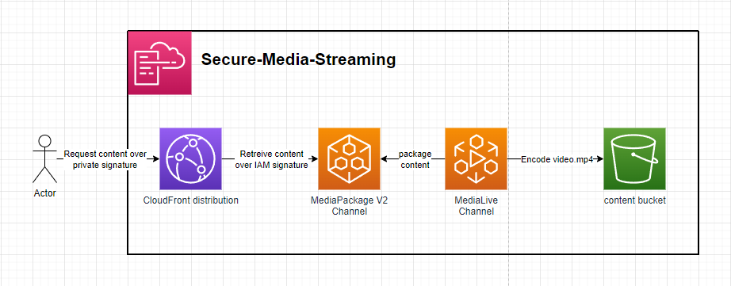

# Secure Media Streaming

The template defines a secure method of streaming content over HLS utilising AWS CloudFront, AWS MediaPackage V2 & AWS MediaLive. The clients make a RSA signed request to CloudFront which signs the request using AWS sigv4 & forwards the request to the MediaPackage V2 Origin Endpoint - This ensures clients can only request the content from CloudFront in a more controlled manner.

# Setup:

1. generate a public-private key pair. E.g. `openssl genrsa -out private_key.pem 2048; openssl rsa -pubout -in private_key.pem -out public_key.pem`. This will generate a `private_key.pem` & `public_key.pem`.
2. Deploy the template including the in-line`public_key.pem` for the `AWS::CloudFront::PublicKey` resource.
3. Add an exmpale video file called `video.mp4` to the `ContentBucket`.
4. Starting the MediaLive Channel will now start transcoding the packaging the `video.mp4` to be consumed over HLS
5. Signed requests using the `private_key.pem` can now be made to the Cloudfront Domain to securely retreive HLS content
  1. Signed requests can be generted using the included `signer.js` when providing the `keyPairId` and `cloudfrontDomain` after deploying the stack
